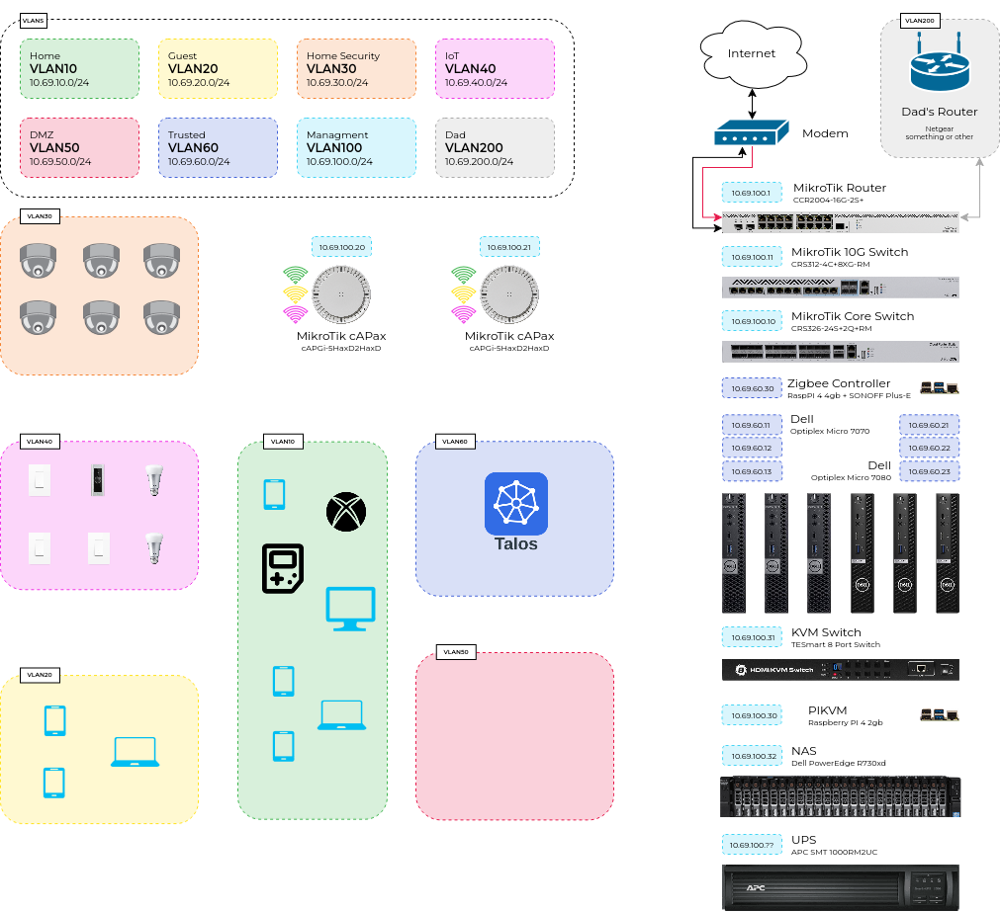

# Network

The entire MikroTik network — router, switches, APs, VLANs, DHCP, BGP, and WiFi — is
managed by Terraform. See [Controlling MikroTik with Terraform](./controlling-mikrotik-with-terraform.md).

## Addressing

Everything lives under `10.69.0.0/16`. Each VLAN gets its own `/24`, numbered by VLAN
ID: **`10.69.<vlan>.0/24`**, with the router as `.1`.

| VLAN | Name | Subnet | Purpose |
| --- | --- | --- | --- |
| 10 | Home | `10.69.10.0/24` | Personal devices |
| 20 | Guest | `10.69.20.0/24` | Isolated guest access |
| 30 | Security | `10.69.30.0/24` | Cameras / surveillance |
| 40 | IoT | `10.69.40.0/24` | Smart-home / untrusted IoT |
| 50 | DMZ | `10.69.50.0/24` | Externally exposed services |
| 60 | Trusted | `10.69.60.0/24` | Kubernetes nodes + trusted hosts |
| 100 | Management | `10.69.100.0/24` | Network gear, OOB (KVM, UPS) |
| 200 | Dad | `10.69.200.0/24` | Separate household segment |

## Switching

Router `ether2–4` are trunk ports carrying all VLANs down to the switches. The
**core switch** (CRS326) aggregates SFP+ links; the **10G switch** (CRS312)
distributes 10G copper. Each switch has its own management IP on VLAN 100 and tags
node/uplink ports appropriately (Trusted for nodes, Management for gear).

## WiFi

Two cAPax APs run under **CAPsMAN**, with AP1 as manager and AP2 as client, so the
`Strudel` SSID roams seamlessly across both. A second SSID, `SprinklerAct Studios`,
is a self-contained config on AP1 pinned to the Dad VLAN (200).

## BGP — where the cluster meets the network

All six nodes peer with the router over BGP (no ARP/L2 tricks). Two speakers, split by
node role so they never collide on a single node:

- **kube-vip** — advertises the **control-plane API VIP** (`10.69.60.10`) from the
  **control-plane** nodes (`makima-1..3`, `.11`/`.12`/`.13`).
- **Cilium** — advertises **`LoadBalancer` service IPs** from the **worker** nodes
  (`rem-1..3`, `.21`/`.22`/`.23`).

- **Router** — AS **65100**, peering to all six nodes.
- **Cluster** — AS **65000**.
- **LoadBalancer pool** — `10.69.255.0/24`, a dedicated BGP-only range that belongs to
  no VLAN subnet (set in `cilium/lb-pool.yaml`).

Setup notes: [MikroTik BGP Setup](./mikrotik-setup-bgp.md).

## Firewall

The router runs a **default-deny** inter-VLAN policy — isolation comes from the
*absence* of an allow rule plus a catch-all drop, not from per-pair block rules.

| From ↓ | Internet | Reaches | Notes |
| --- | --- | --- | --- |
| Home (10) | ✅ | Trusted, DMZ | |
| Guest (20) | ✅ | — | fully isolated (also wants AP client isolation) |
| Security (30) | ❌ | — | fully isolated |
| IoT (40) | ❌ | — | fully isolated |
| DMZ (50) | ✅ | — | inbound port-forwards added later |
| Trusted (60) | ✅ | — | intra-cluster traffic is same-VLAN |
| Management (100) | ✅ | everything | |
| Dad (200) | ✅ | — | isolated household segment |

Router **`input`** is locked to the Management VLAN once enforced, but DHCP, DNS, NTP,
and BGP (from cluster nodes) are always permitted from every VLAN so enabling the policy
can't black-hole the network.

> **Staging.** The catch-all drop rules are created **disabled** (`enforce_firewall =
> false` in `terraform/main.tf`). Apply once — nothing changes yet — verify each flow,
> then set `enforce_firewall = true` and apply again to enforce. Run Terraform from the
> Management VLAN, since enforcement restricts router admin to Management.

> The diagram source is editable — [`network-plan.drawio`](../assets/network-plan.drawio).
